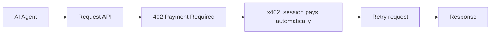

# hoodgrow-x402-aa

**The easiest way for an ERC-4337 / account-abstraction agent to pay x402
API calls — with a dedicated, non-custodial EOA, since its smart-wallet
signature doesn't work with x402 yet.**

A lightweight, typed SDK: generate a spend wallet, fund it from your
agent's own smart wallet, and every request through it pays x402
(HTTP 402) challenges automatically — retried and returned, no manual
handling — against **any** x402 merchant, not just
[HoodGrow](https://www.hoodgrow.com).



## Features

- 🤖 Built for ERC-4337 / account-abstraction agents
- 💳 Automatic x402 payment handling — detect a 402, pay, retry, transparently
- 🔒 Non-custodial — the private key never leaves your process
- ⚡ Minimal dependencies (`eth-account`, `requests`, `x402`)
- 🌐 Works against any x402-compatible API, not just HoodGrow
- 📦 Fully typed
- 🟦 TypeScript implementation also available (see Related projects)

## Installation

```bash
pip install hoodgrow-x402-aa
```

## Quick start

```python
from hoodgrow_x402_aa import create_spend_wallet, get_usdc_balance, x402_session

# 1. Generate a dedicated spend wallet — locally, once.
wallet = create_spend_wallet()
print("fund this address:", wallet.address)
# store wallet.private_key yourself (env var / secret manager) — this
# library never sees it again after this call returns.

# 2. Fund `wallet.address` with a little USDC on Base — from your agent's
#    own smart wallet, using its own transfer/send call (not this library).

# 3. Check the balance whenever you want to know if it needs topping up.
balance = get_usdc_balance(wallet.address)

# 4. Pay any x402 endpoint with it — payment happens automatically.
session = x402_session(wallet)
resp = session.get("https://www.hoodgrow.com/api/agent/token/NVDA")
print(resp.json())
```

Restarting your agent? Rehydrate the same wallet from the key you stored:

```python
from hoodgrow_x402_aa import spend_wallet_from_private_key

wallet = spend_wallet_from_private_key(YOUR_STORED_PRIVATE_KEY)
```

## Why this exists

x402's "exact" EVM scheme settles payment via EIP-3009
`transferWithAuthorization`, which recovers the payer's address from a
plain secp256k1 (ECDSA) signature. An account-abstraction agent's owner
key is often a P256/WebAuthn passkey — a different curve entirely, not
`ecrecover`-compatible — or even when it is secp256k1, the recovered
address is the *owner's*, not the smart wallet's own address, which the
facilitator's `from`-address check rejects. Full ERC-1271/ERC-6492
smart-wallet support is an open, unshipped feature across today's x402
facilitators — see
[coinbase/x402#639](https://github.com/coinbase/x402/issues/639).

The fix isn't routing your AA wallet's signature through x402 directly —
it's giving your agent a small, dedicated EOA it funds itself, purely for
x402 spending, separate from whatever wallet it uses for everything else.
That's what this package does.

## Non-custodial — read this before using it

**We never see your private key. Nobody does but you.**

- `create_spend_wallet()` generates a fresh secp256k1 keypair *entirely
  inside your own process*, using `eth_account`. Nothing is transmitted,
  logged, or persisted by this library.
- The private key is returned to you once, in memory. Store it yourself
  (env var, secret manager) — this library keeps no copy after the call
  returns.
- Funding the spend wallet is **your** agent's job, using **your** agent's
  own smart-wallet infrastructure. This library never moves funds itself —
  it only tells you the address to send to and (via `get_usdc_balance`)
  how much is there.
- The published package is open source. Don't trust this description —
  read `src/hoodgrow_x402_aa/`, it's short.

## API

| Function | Returns |
| --- | --- |
| `create_spend_wallet()` | A new `SpendWallet(address, private_key, account)` |
| `spend_wallet_from_private_key(key)` | Rehydrates a `SpendWallet` from a key you already have |
| `get_usdc_balance(address, rpc_url=DEFAULT_BASE_RPC_URL)` | USDC balance (float, human units) on Base |
| `x402_session(wallet)` | A `requests.Session` that auto-pays x402 challenges — `wallet` can be a `SpendWallet`, an `eth_account` `LocalAccount`, or a raw private key string |

`get_usdc_balance` talks to Base over plain JSON-RPC (`eth_call`) — no
`web3.py` dependency, one read-only call. Override `rpc_url` if you run
your own node.

## Use cases

- AI assistants and copilots
- MCP servers
- Autonomous agents built on ERC-4337 smart wallets
- Multi-agent systems
- Research agents
- Trading bots
- Automation workflows

## Payment safety

Every payment `x402_session` makes is real USDC on Base mainnet — not
reversible. Only fund the spend wallet with what you're willing to spend,
and never reuse an EOA that also holds funds you care about for anything
else.

## Related projects

- [HoodGrow](https://www.hoodgrow.com) — stock token data for Robinhood
  Chain, the project this SDK was built for
- [HoodGrow API](https://www.hoodgrow.com/api-access) — the x402-protected
  endpoints this SDK was built to pay for
- [hoodgrow-x402-aa (TypeScript)](https://www.npmjs.com/package/hoodgrow-x402-aa) —
  TypeScript implementation
- [x402](https://www.x402.org) — the HTTP 402 payment protocol

## Development

```bash
pip install -e ".[dev]"
pytest
```

## License

MIT
